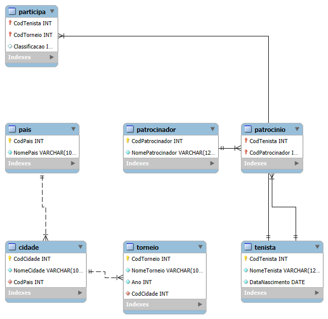

# 🎾 Tennis Tournament Database

Relational database project for managing tennis tournaments, players, sponsors, and participation results, designed with a normalized schema and ER diagram.

---

## Project Overview

This project models a **tennis tournament management system** using a relational database.  
It includes entities such as players, tournaments, cities, countries, sponsors, and their relationships.

The database was developed focusing on:
- Data normalization
- Referential integrity
- Clear entity relationships
- Realistic SQL queries

---

## Technologies Used

- MySQL
- SQL (DDL & DML)
- ER Diagram (Entity-Relationship)
- Git & GitHub

---

## What This Project Demonstrates

- Database modeling and normalization (1NF, 2NF, 3NF)
- Use of **primary keys** and **foreign keys**
- Many-to-many relationships
- Use of **JOINs**, **GROUP BY**, **HAVING**, and aggregate functions
- Organized SQL scripts for easy execution

---

## Project Structure

```text
tennis-tournament-database/
│
├── diagram/
│   └── er_diagram.png
|
├── sql/
│   ├── 01_create_database.sql
│   ├── 02_create_tables.sql
│   ├── 03_inserts.sql
│   └── 04_queries.sql
│
└── README.md
```

---

## Entity-Relationship Diagram

The diagram below represents the logical structure of the database, including
entities, attributes, primary keys, foreign keys, and relationships.



---

## How to Run Locally

1. Clone the repository:
   ```bash
   git clone https://github.com/gabrielgodoiii/tennis-tournament-database.git
   ```
   
2. Open **MySQL Workbench** (or any MySQL-compatible database client).

3. Execute the SQL scripts **in the correct order**:
   - `sql/01_create_database.sql`
   - `sql/02_create_tables.sql`
   - `sql/03_inserts.sql`
   - `sql/04_queries.sql`

4. After executing the scripts, the database will be fully created and ready for use.

---

## 🇧🇷 Descrição 

Este projeto modela um banco de dados relacional para gerenciamento de torneios de tênis, incluindo informações sobre:

- `Tenistas`

- `Torneios`

- `Cidades e Países`

- `Patrocinadores`

- `Participações e classificações`

O desenvolvimento priorizou boas práticas de modelagem de dados, normalização, integridade referencial e consultas SQL realistas.

---

## Autor

**Gabriel Godoi**  
Estudante e entusiasta da área de Dados, com foco em análise, visualização e construção de dashboards interativos em Python.
Projeto desenvolvido para fins educacionais e de portfólio.


